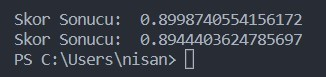
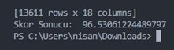

# Naive bayes and KNN Algorithm Without Sklearn
KNN and Naive Bayes algorithms were coded without using a ready-made library, trained and tested with Dry Bean dataset.

### Naive Bayes Result

### KNN Result

